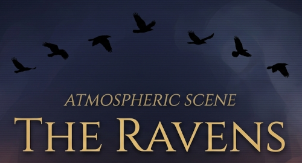

# The Ravens: Atmospheric Visualization Architecture

A high-fidelity web application utilizing a multi-layered CSS rendering stack, real-time canvas overlays, and an integrated post-processing pipeline.

## Technical Overview

The core of this application is a "Deep-Stack" layering system. By isolating environmental elements, entities, and UI across a 100-point Z-index scale, the application achieves a distinct sense of parallax depth while maintaining interactive performance.

### The Stacking Order (Z-Index Hierarchy)

| Layer Group | Z-Index | DOM IDs | Functional Purpose |
| :--- | :--- | :--- | :--- |
| **Interactive Overlay** | 99 | #raven-circles-canvas | Top-level mouse interaction and particle drawing. |
| **User Interface** | 90 | .HUD | Glassmorphic control panel for scene manipulation. |
| **Post-Processing** | 80-82 | #vignette, #scanlines, #noise | Global screen filters (Vignette, CRT, Grain). |
| **Narrative UI** | 20 | .text-stage | Dynamic titles and story typography. |
| **Entities** | 4-7 | #ravens-far, #ravens-mid, etc. | Parallax-ready flocking layers for ravens. |
| **Environment** | 0-3 | #sky-canvas, #house-layer, etc. | Base environmental silhouettes and gradients. |

## Key Technical Implementation

### Pointer Event Management
To allow the user to interact with the HUD (Z-index 90) while a canvas sits on top of it (Z-index 99), the system utilizes `pointer-events: none` on all non-interactive visual overlays. This ensures that mouse coordinates can be captured by the background scripts without blocking the functional UI buttons.

### Atmospheric Pipeline
The application simulates a camera lens through a series of fixed-position div elements:
* **Vignette:** A radial gradient that focuses visual weight on the center of the viewport.
* **Scanlines:** A repeating linear gradient simulating CRT monitor artifacts.
* **Film Grain:** A noise texture layer to reduce color banding in dark gradients.

## Installation

1. Clone the repository.
2. Ensure the required Google Fonts (Cinzel and Crimson Text) are linked in the document head.
3. Serve the directory via a local server or open `index.html` directly in a browser.

## Configuration

The visual theme is managed via CSS Custom Properties located in the `:root` selector. Key variables include:

* `--gold-mute`: The primary border and label color.
* `--gold-bright`: The primary highlight and text-glow color.
* `--blur-heavy`: Controls the backdrop-filter intensity for the HUD.

---
*Original Prompt Reference:*
> do you think you coul dmake a README in .md format for my github page based on what we have put togeter and what you seen for this